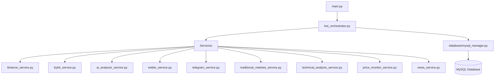
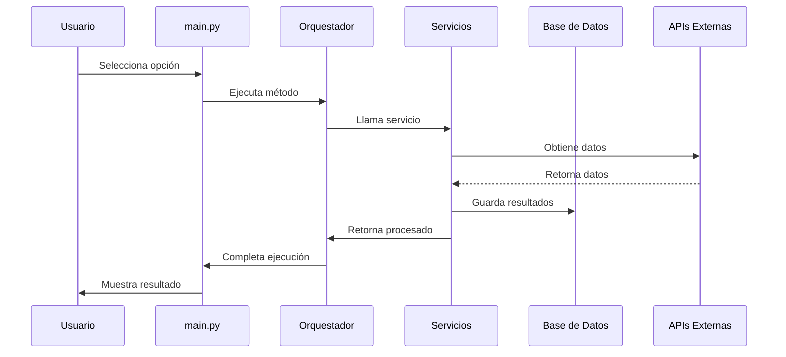
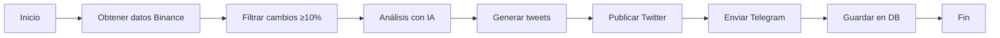
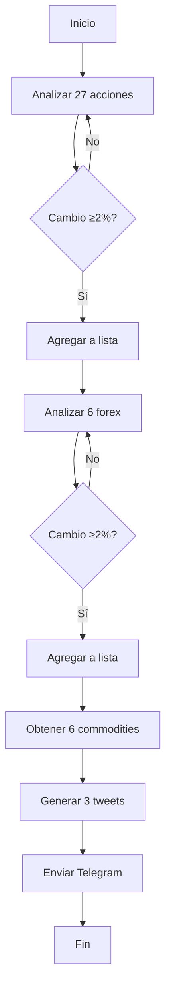
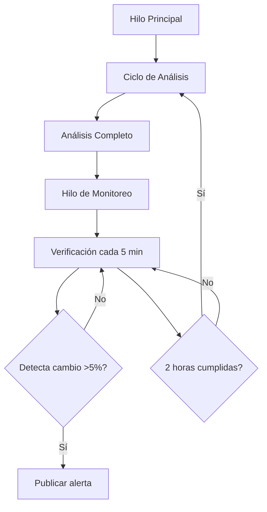
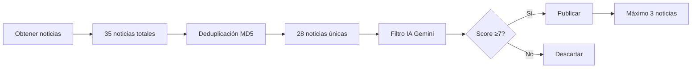
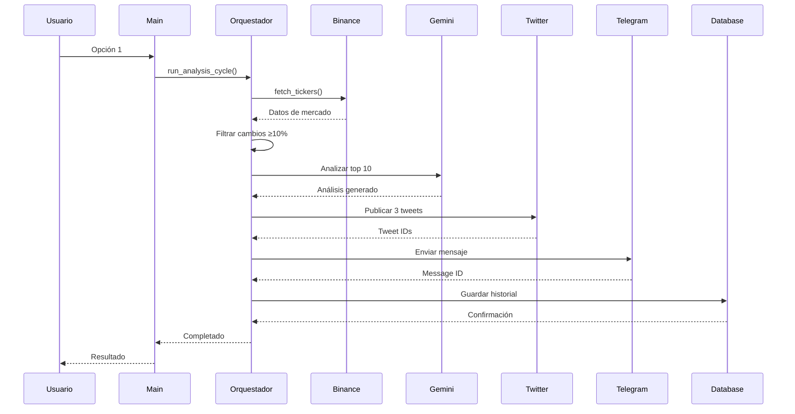
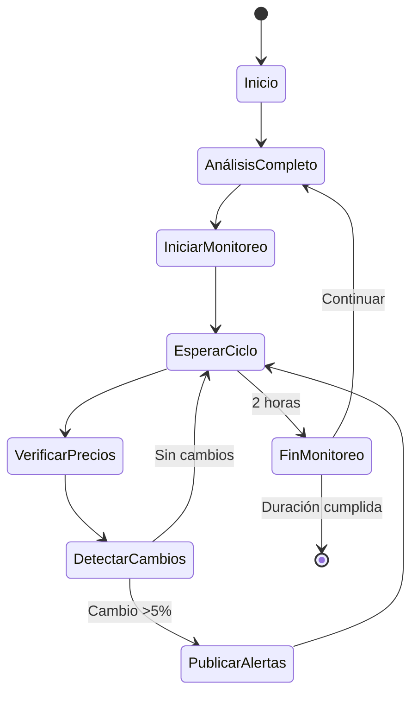

# 📖 Manual de Usuario - BotCrypto V3

## 📑 Tabla de Contenidos

1. [Introducción](#introducción)
2. [Instalación y Configuración](#instalación-y-configuración)
3. [Arquitectura del Sistema](#arquitectura-del-sistema)
4. [Menú Principal](#menú-principal)
5. [Funcionalidades Detalladas](#funcionalidades-detalladas)
6. [Base de Datos](#base-de-datos)
7. [APIs y Servicios](#apis-y-servicios)
8. [Flujos de Trabajo](#flujos-de-trabajo)
9. [Solución de Problemas](#solución-de-problemas)
10. [Mejores Prácticas](#mejores-prácticas)

---

## 1. Introducción

### ¿Qué es BotCrypto V3?

BotCrypto V3 es un bot inteligente de trading que combina análisis de múltiples mercados (criptomonedas, acciones, forex, commodities) con inteligencia artificial para generar señales de trading, monitorear precios en tiempo real y publicar automáticamente en redes sociales.

### Características Principales

- **Análisis Multi-Mercado**: Crypto, Stocks, Forex, Commodities
- **IA Integrada**: Google Gemini 2.5 Flash para análisis y filtrado
- **Análisis Técnico**: 7 indicadores profesionales
- **Monitoreo en Tiempo Real**: Detección de pumps/dumps cada 5 minutos
- **Scraping de Noticias**: CryptoPanic + Google News con filtro IA
- **Publicación Automática**: Twitter y Telegram
- **Position Sizing**: Gestión de riesgo automática

### Versiones

- **V1**: Análisis básico de crypto
- **V2**: Análisis con IA + publicación automática
- **V3**: Multi-mercado + análisis técnico + monitoreo continuo + noticias

---

## 2. Instalación y Configuración

### Requisitos del Sistema

```
- Python 3.11 o superior
- MySQL 8.0 o superior
- 4 GB RAM mínimo
- Conexión a Internet estable
```

### Instalación Paso a Paso

#### 1. Clonar Repositorio

```bash
git clone https://github.com/AndresDvst/BotCryptoV2.git
cd BotCryptoV2
```

#### 2. Crear Entorno Virtual

```bash
python -m venv venv

# Windows
venv\Scripts\activate

# Linux/Mac
source venv/bin/activate
```

#### 3. Instalar Dependencias

```bash
pip install -r requirements.txt
```

#### 4. Configurar Base de Datos

```bash
# Iniciar MySQL
mysql -u root -p

# Crear base de datos
CREATE DATABASE crypto_bot;
```

#### 5. Configurar Variables de Entorno

```bash
# Copiar archivo de ejemplo
cp .env.example .env

# Editar .env con tus credenciales
notepad .env  # Windows
nano .env     # Linux/Mac
```

### Configuración del Archivo `.env`

```env
# === GOOGLE GEMINI API ===
GEMINI_API_KEY=tu_api_key_aqui

# === TELEGRAM BOT ===
TELEGRAM_BOT_TOKEN=tu_bot_token_aqui
TELEGRAM_CHAT_ID=tu_chat_id_aqui

# === TWITTER/X ===
TWITTER_USERNAME=tu_usuario
TWITTER_PASSWORD=tu_contraseña

# === MYSQL DATABASE ===
MYSQL_HOST=localhost
MYSQL_USER=root
MYSQL_PASSWORD=1234
MYSQL_DATABASE=crypto_bot
MYSQL_PORT=3306

# === BOT CONFIGURATION ===
REPORT_INTERVAL_HOURS=2
```

### Obtener Credenciales

#### Google Gemini API

1. Ir a [Google AI Studio](https://aistudio.google.com/app/apikey)
2. Crear nuevo API Key
3. Copiar y pegar en `.env`

#### Telegram Bot

1. Hablar con [@BotFather](https://t.me/BotFather)
2. Crear nuevo bot: `/newbot`
3. Copiar token
4. Obtener chat ID: `/start` en [@userinfobot](https://t.me/userinfobot)

#### Twitter/X

1. Usar credenciales de tu cuenta
2. **IMPORTANTE**: Usar cuenta de prueba inicialmente

---

## 3. Arquitectura del Sistema

### Diagrama de Componentes



### Estructura de Directorios

```
BotCryptoV2/
├── main.py                          # Punto de entrada
├── bot_orchestrator.py              # Orquestador principal
├── config/
│   └── config.py                    # Configuración
├── services/
│   ├── binance_service.py           # API Binance
│   ├── bybit_service.py             # API Bybit
│   ├── ai_analyzer_service.py       # Google Gemini
│   ├── twitter_service.py           # Publicación Twitter
│   ├── telegram_service.py          # Publicación Telegram
│   ├── traditional_markets_service.py  # Stocks/Forex/Commodities
│   ├── technical_analysis_service.py   # Indicadores técnicos
│   ├── price_monitor_service.py     # Monitoreo continuo
│   └── news_service.py              # Scraping noticias
├── database/
│   ├── mysql_manager.py             # Gestor MySQL
│   └── v3_schema.sql                # Schema V3
├── utils/
│   └── logger.py                    # Sistema de logs
└── images/
    └── signals/                     # Gráficos generados
```

### Flujo de Datos



---

## 4. Menú Principal

### Opciones Disponibles

```
============================================================
💡 MENÚ PRINCIPAL - CRYPTO BOT V3
============================================================
1. 🚀 Ejecutar análisis ahora
2. ⏰ Programar ejecuciones automáticas
3. 🔥 Ambas (ejecutar ahora + programar)
4. 📊 Abrir Dashboard Web
5. 🧹 Limpiar repositorio (archivos temporales)
6. 🗑️  Limpiar base de datos (CUIDADO!)
7. 📈 Análisis de Mercados Tradicionales
8. 🎯 Análisis Técnico con Señales de Trading
9. 🔄 Modo Continuo (Monitoreo cada 5 min)
10. 📰 Scraping de Noticias (CryptoPanic + Google News)
0. 👋 Salir
============================================================
```

### Descripción de Opciones

| Opción | Función                   | Duración Aprox. | Publicaciones       |
| ------ | ------------------------- | --------------- | ------------------- |
| 1      | Análisis crypto inmediato | 2-3 min         | Twitter + Telegram  |
| 2      | Programar cada 2 horas    | Indefinido      | Automático          |
| 3      | Ejecutar + programar      | Indefinido      | Automático          |
| 4      | Abrir dashboard web       | Instantáneo     | N/A                 |
| 5      | Limpiar archivos temp     | 10 seg          | N/A                 |
| 6      | Limpiar base de datos     | 5 seg           | N/A                 |
| 7      | Mercados tradicionales    | 1-2 min         | 3 tweets + Telegram |
| 8      | Análisis técnico          | 3-5 min         | Top 3 señales       |
| 9      | Modo continuo             | Personalizable  | Alertas automáticas |
| 10     | Scraping noticias         | 1-2 min         | Top 3 noticias      |

---

## 5. Funcionalidades Detalladas

### 5.1 Opción 1: Análisis Crypto Ahora

#### ¿Qué hace?

Ejecuta un análisis completo del mercado de criptomonedas y publica los resultados.

#### Proceso



#### Datos Obtenidos

- **Binance**: Todas las criptomonedas
- **Filtro**: Cambios ≥10% en 24h
- **Análisis**: Top 10 por volumen

#### Publicaciones

**Twitter**: Hasta 3 tweets

```
🚀 ANÁLISIS MATUTINO - CRYPTO

📈 BTC/USDT: +12.5%
   Precio: $42,350
   Vol 24h: $28.5B

🔥 ETH/USDT: +8.3%
   Precio: $2,245
   Vol 24h: $15.2B

#Crypto #Bitcoin #Trading
```

**Telegram**: Mensaje consolidado con análisis IA

---

### 5.2 Opción 7: Mercados Tradicionales

#### ¿Qué hace?

Analiza acciones, forex y commodities con cambios significativos.

#### Mercados Analizados

**Acciones (27 principales)**:

```
AAPL, MSFT, GOOGL, AMZN, TSLA, META, NVDA, JPM,
V, WMT, JNJ, PG, MA, HD, DIS, PYPL, NFLX, ADBE,
CRM, INTC, CSCO, PEP, KO, NKE, MCD, BA, IBM
```

**Forex (6 pares)**:

```
EUR/USD, GBP/USD, USD/JPY, AUD/USD, USD/CAD, USD/CHF
```

**Commodities (6)**:

```
Oro (GC=F), Plata (SI=F), Crudo WTI (CL=F),
Brent (BZ=F), Gasolina (RB=F), Petróleo calefacción (HO=F)
```

#### Flujo de Trabajo



#### Ejemplo de Publicación

**Tweet 1 - Acciones**:

```
📈 ACCIONES EN MOVIMIENTO

🟢 NVDA: +5.2% → $485.30
   Cap: $1.2T

🟢 TSLA: +3.8% → $245.60
   Cap: $780B

#Stocks #Trading
```

---

### 5.3 Opción 8: Análisis Técnico

#### ¿Qué hace?

Genera señales de trading profesionales con indicadores técnicos.

#### Indicadores Utilizados

| Indicador       | Período | Uso                      |
| --------------- | ------- | ------------------------ |
| RSI             | 14      | Sobrecompra/sobreventa   |
| MACD            | 12/26/9 | Cruces alcistas/bajistas |
| Bollinger Bands | 20/2    | Volatilidad              |
| ATR             | 14      | Stop Loss dinámico       |
| EMA 20/50       | -       | Golden/Death Cross       |
| SMA 20/50       | -       | Tendencia                |
| Stochastic      | 14/3    | Momentum                 |

#### Sistema de Scoring

```python
score = 0

# RSI
if rsi < 30: score += 2  # Sobreventa
if rsi > 70: score -= 2  # Sobrecompra

# MACD
if macd_cross_up: score += 2
if macd_cross_down: score -= 2

# EMAs
if ema20 > ema50: score += 2  # Golden Cross
if ema20 < ema50: score -= 2  # Death Cross

# Bollinger
if price < bb_lower: score += 1
if price > bb_upper: score -= 1

# Señal final
if score >= 4: LONG
if score <= -4: SHORT
else: NEUTRAL
```

#### Cálculo de Position Sizing

```python
# Ejemplo
capital = 1000 USD
risk_percent = 2%
entry_price = 42,350
stop_loss = 41,200

risk_usd = 1000 * 0.02 = 20 USD
risk_per_unit = 42,350 - 41,200 = 1,150
position_size = 20 / 1,150 = 0.0174 BTC
position_value = 0.0174 * 42,350 = 737 USD
```

#### Gráfico Generado

El bot genera gráficos con 3 subplots:

1. **Precio + Indicadores**
   - Precio de cierre
   - Bollinger Bands (superior, media, inferior)
   - EMA 20 y EMA 50
   - Líneas: Entrada, SL, TP

2. **RSI**
   - RSI con líneas en 70 y 30

3. **MACD**
   - MACD, Señal e Histograma

---

### 5.4 Opción 9: Modo Continuo

#### ¿Qué hace?

Ejecuta el bot en modo continuo alternando entre análisis completos y monitoreo de precios.

#### Arquitectura Multihilo



#### Configuración

```python
# Parámetros ajustables en price_monitor_service.py
check_interval = 300  # 5 minutos
pump_dump_threshold = 5.0  # 5% de cambio
```

#### Detección de Pumps/Dumps

```python
# Lógica
old_price = cache[symbol]
current_price = ticker['last']
change_percent = ((current - old) / old) * 100

if abs(change_percent) >= 5.0:
    alert_type = 'pump' if change > 0 else 'dump'
    publish_alert()
```

---

### 5.5 Opción 10: Scraping de Noticias

#### ¿Qué hace?

Obtiene noticias de múltiples fuentes, las filtra con IA y publica las más relevantes.

#### Fuentes de Noticias

**CryptoPanic API**:

```
URL: https://cryptopanic.com/api/v1/posts/
Filtro: important
Límite: 10 noticias
```

**Google News RSS** (5 feeds):

```
1. Cryptocurrency (general)
2. Bitcoin
3. Ethereum
4. Stock Market
5. Forex
```

#### Proceso de Filtrado



#### Scoring de Relevancia

```
10: Extremadamente importante (crash, regulación mayor, hack grande)
7-9: Muy relevante (movimientos significativos, anuncios importantes)
4-6: Moderadamente relevante
1-3: Poco relevante o clickbait
```

---

## 6. Base de Datos

### Tablas Principales

#### Tablas V2 (Originales)

```sql
-- Historial de análisis
CREATE TABLE analysis_history (
    id INT AUTO_INCREMENT PRIMARY KEY,
    analysis_type VARCHAR(50),
    data JSON,
    created_at TIMESTAMP DEFAULT CURRENT_TIMESTAMP
);

-- Tweets publicados
CREATE TABLE tweets_history (
    id INT AUTO_INCREMENT PRIMARY KEY,
    tweet_text TEXT,
    tweet_id VARCHAR(100),
    created_at TIMESTAMP DEFAULT CURRENT_TIMESTAMP
);

-- Mensajes Telegram
CREATE TABLE telegram_history (
    id INT AUTO_INCREMENT PRIMARY KEY,
    message_text TEXT,
    message_id VARCHAR(100),
    created_at TIMESTAMP DEFAULT CURRENT_TIMESTAMP
);
```

#### Tablas V3 (Nuevas)

```sql
-- Señales de trading
CREATE TABLE trading_signals (
    id INT AUTO_INCREMENT PRIMARY KEY,
    symbol VARCHAR(20),
    signal_type ENUM('LONG', 'SHORT', 'NEUTRAL'),
    entry_price DECIMAL(20,8),
    stop_loss DECIMAL(20,8),
    take_profit DECIMAL(20,8),
    confidence DECIMAL(5,2),
    indicators JSON,
    created_at TIMESTAMP DEFAULT CURRENT_TIMESTAMP
);

-- Alertas de precio
CREATE TABLE price_alerts (
    id INT AUTO_INCREMENT PRIMARY KEY,
    symbol VARCHAR(20),
    alert_type ENUM('pump', 'dump'),
    price_before DECIMAL(20,8),
    price_after DECIMAL(20,8),
    change_percent DECIMAL(10,2),
    created_at TIMESTAMP DEFAULT CURRENT_TIMESTAMP
);

-- Nuevos pares detectados
CREATE TABLE new_pairs_detected (
    id INT AUTO_INCREMENT PRIMARY KEY,
    symbol VARCHAR(20) UNIQUE,
    exchange VARCHAR(20),
    first_price DECIMAL(20,8),
    detected_at TIMESTAMP DEFAULT CURRENT_TIMESTAMP
);

-- Historial de noticias
CREATE TABLE news_history (
    id INT AUTO_INCREMENT PRIMARY KEY,
    news_hash VARCHAR(32) UNIQUE,
    title TEXT,
    url TEXT,
    source VARCHAR(50),
    category VARCHAR(50),
    relevance_score INT,
    published_twitter BOOLEAN DEFAULT FALSE,
    published_telegram BOOLEAN DEFAULT FALSE,
    created_at TIMESTAMP DEFAULT CURRENT_TIMESTAMP
);
```

### Consultas Útiles

```sql
-- Ver últimas señales de trading
SELECT * FROM trading_signals
ORDER BY created_at DESC
LIMIT 10;

-- Ver alertas de pumps/dumps
SELECT * FROM price_alerts
WHERE change_percent > 10
ORDER BY created_at DESC;

-- Ver noticias publicadas
SELECT title, relevance_score, created_at
FROM news_history
WHERE published_twitter = TRUE
ORDER BY created_at DESC;

-- Estadísticas de señales
SELECT
    signal_type,
    COUNT(*) as total,
    AVG(confidence) as avg_confidence
FROM trading_signals
GROUP BY signal_type;
```

---

## 7. APIs y Servicios

### Google Gemini API

**Modelo**: gemini-2.5-flash-latest  
**Rate Limit**: ~60 requests/minuto  
**Uso**: Análisis de texto, filtrado de noticias

```python
# Ejemplo de uso
prompt = "Analiza esta noticia..."
response = ai_analyzer.analyze_text(prompt)
```

### Binance API

**Librería**: ccxt  
**Rate Limit**: 1200 requests/minuto  
**Endpoints usados**:

- `fetch_tickers()` - Todos los pares
- `fetch_ohlcv()` - Datos históricos
- `load_markets()` - Lista de mercados

### Yahoo Finance (yfinance)

**Uso**: Mercados tradicionales  
**Datos**: Acciones, forex, commodities  
**Período**: 2 días para cambios

```python
ticker = yf.Ticker('AAPL')
hist = ticker.history(period='2d')
```

### CryptoPanic API

**Token**: Gratuito (limitado)  
**Endpoint**: `/api/v1/posts/`  
**Filtro**: Noticias importantes

### Google News RSS

**Formato**: RSS/XML  
**Parser**: feedparser  
**Delay**: 1 segundo entre feeds

---

## 8. Flujos de Trabajo

### Flujo Completo: Análisis Matutino



### Flujo: Modo Continuo



---

## 9. Solución de Problemas

### Errores Comunes

#### Error: "MySQL connection failed"

**Causa**: Base de datos no iniciada o credenciales incorrectas

**Solución**:

```bash
# Verificar MySQL
mysql -u root -p

# Verificar .env
MYSQL_PASSWORD=tu_contraseña_correcta
```

#### Error: "Gemini API quota exceeded"

**Causa**: Límite de requests excedido

**Solución**:

- Esperar 1 minuto
- Reducir frecuencia de análisis
- Verificar API key

#### Error: "Twitter login failed"

**Causa**: Credenciales incorrectas o cuenta bloqueada

**Solución**:

- Verificar usuario/contraseña
- Usar cuenta de prueba
- Revisar si hay captcha

### Logs

**Ubicación**: Consola y archivo `bot.log`

**Niveles**:

- `INFO`: Operaciones normales
- `WARNING`: Advertencias no críticas
- `ERROR`: Errores que requieren atención

**Ejemplo**:

```
2026-01-28 10:00:00 - INFO - ✅ Análisis completado
2026-01-28 10:00:05 - WARNING - ⚠️ Rate limit cercano
2026-01-28 10:00:10 - ERROR - ❌ Error en publicación
```

---

## 10. Mejores Prácticas

### Seguridad

✅ **Hacer**:

- Usar `.env` para credenciales
- Mantener `.gitignore` actualizado
- Usar cuenta de prueba para Twitter
- Hacer backups de base de datos

❌ **No hacer**:

- Compartir API keys
- Subir `.env` a GitHub
- Usar cuenta principal de Twitter
- Ignorar rate limits

### Optimización

**Frecuencia de Ejecución**:

- Análisis crypto: Cada 2 horas
- Mercados tradicionales: 1 vez al día (9:30 AM EST)
- Análisis técnico: 1-2 veces al día
- Modo continuo: Según necesidad
- Noticias: Cada 7-10 minutos

**Recursos**:

- Cerrar navegador cuando no se use
- Limpiar archivos temporales regularmente
- Monitorear uso de RAM

### Monitoreo

**Revisar diariamente**:

- Logs de errores
- Publicaciones en Twitter/Telegram
- Base de datos (tamaño)
- Rate limits de APIs

**Revisar semanalmente**:

- Rendimiento de señales
- Calidad de noticias
- Ajustar parámetros

---

## Apéndices

### A. Comandos Útiles

```bash
# Iniciar bot
python main.py

# Ver logs en tiempo real
tail -f bot.log

# Backup de base de datos
mysqldump -u root -p crypto_bot > backup.sql

# Restaurar base de datos
mysql -u root -p crypto_bot < backup.sql

# Limpiar caché de Python
find . -type d -name "__pycache__" -exec rm -r {} +
```

### B. Atajos de Teclado

- `Ctrl+C`: Detener ejecución
- `Ctrl+Z`: Suspender (no recomendado)

### C. Recursos Adicionales

- [Documentación Gemini](https://ai.google.dev/)
- [Documentación CCXT](https://docs.ccxt.com/)
- [Documentación yfinance](https://pypi.org/project/yfinance/)

---

**Última Actualización**: 2026-01-28  
**Versión del Manual**: 1.0  
**Versión del Bot**: 3.0
