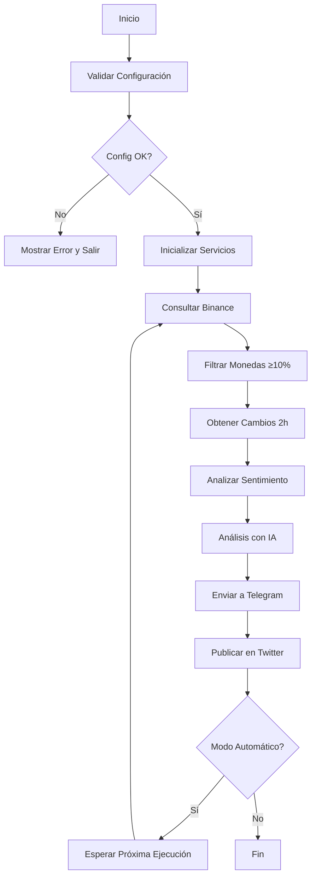

# 🤖 Crypto Trading Bot V3 - Análisis Multi-Mercado con IA

<div align="center">
<a href="https://wa.link/a3j64p" target="_blank" rel="noopener noreferrer"></a>
<a href="https://twitter.com/AndresDvst25" target="_blank" rel="noopener noreferrer"></a>
<a href="https://www.facebook.com/andres.campos.732122" target="_blank" rel="noopener noreferrer"></a>
<a href="https://www.instagram.com/andres.devback/" target="_blank" rel="noopener noreferrer"></a>
<a href="https://www.linkedin.com/in/andresdevback22/" target="_blank" rel="noopener noreferrer"></a>
<a href="https://github.com/AndresDvst" target="_blank" rel="noopener noreferrer"></a>
<a href="https://discord.com/users/1133809866130067476" target="_blank" rel="noopener noreferrer"></a>
</div>

<br>

<div align="center">

**Bot inteligente de trading que analiza criptomonedas, mercados tradicionales (stocks/forex/commodities), genera señales técnicas con IA, monitorea precios en tiempo real, y publica automáticamente en Telegram y Twitter**

[](https://www.python.org/downloads/)
[](LICENSE)
[](https://ai.google.dev/)
[](https://github.com/AndresDvst/BotCryptoV2)

</div>

---

## 🆕 Novedades en V3

### 🌟 Nuevas Funcionalidades Implementadas

- **📈 Análisis de Mercados Tradicionales**
  - Acciones del S&P 500 (27 principales)
  - Pares de Forex (6 principales)
  - Commodities (Oro, Plata, Crudo, Brent, etc.)
  - Publicación automática en Twitter y Telegram

- **🎯 Análisis Técnico Avanzado**
  - Indicadores: RSI, MACD, Bollinger Bands, ATR, EMAs, SMAs, Stochastic
  - Señales de trading: LONG/SHORT/NEUTRAL con confianza 0-100%
  - Position Sizing automático basado en riesgo
  - Stop Loss y Take Profit dinámicos (ATR-based)
  - Generación de gráficos visuales con matplotlib

- **🔄 Modo Continuo con Monitoreo en Tiempo Real**
  - Arquitectura multihilo (threading)
  - Detección de pumps/dumps >5% cada 5 minutos
  - Detección de nuevos pares en Binance
  - Alertas automáticas en Twitter y Telegram
  - Alterna entre análisis completos y monitoreo de 2 horas

- **📰 Scraper de Noticias con IA**
  - Integración con CryptoPanic API
  - Scraping de Google News RSS (5 feeds)
  - Filtro de relevancia con Gemini (scoring 1-10)
  - Sistema de deduplicación con hash MD5
  - Publicación automática de noticias relevantes (score ≥7)

---

## 📋 Tabla de Contenidos

- [✨ Características](#-características)
- [🚀 Instalación Rápida](#-instalación-rápida)
- [⚙️ Configuración](#️-configuración)
- [💻 Uso](#-uso)
- [🏗️ Arquitectura](#️-arquitectura)
- [📊 Ejemplo de Reporte](#-ejemplo-de-reporte)
- [🛠️ Solución de Problemas](#️-solución-de-problemas)
- [🔐 Seguridad](#-seguridad)
- [📝 Buenas Prácticas](#-buenas-prácticas)

---

## ✨ Características

### 🎯 Funcionalidades Principales

- **📈 Análisis de Mercado en Tiempo Real**
  - Consulta automática a Binance para todas las criptomonedas
  - Filtrado inteligente de monedas con cambios ≥10% en 24h
  - Análisis de cambios en las últimas 2 horas
- **🧠 Análisis con IA (Google Gemini 2.5 Flash)**
  - Generación automática de análisis y recomendaciones
  - Evaluación de riesgos y oportunidades
  - Insights basados en datos del mercado

- **📊 Análisis de Sentimiento del Mercado**
  - Fear & Greed Index en tiempo real
  - Datos globales del mercado (CoinGecko)
  - Monedas en tendencia

- **📱 Publicación Automática**
  - Envío de reportes formateados a Telegram
  - Publicación automática en Twitter/X con imágenes
  - Reportes cada 2 horas + reporte matutino a las 6 AM

- **🔄 Ejecución Programada**
  - Scheduler integrado para ejecuciones automáticas
  - Reinicio manual en caliente sin detener el bot
  - Logs con colores para fácil seguimiento

### 🛡️ Sistema Profesional

- **📝 Logging Avanzado**
  - Logs con colores en consola
  - Archivos de log diarios automáticos
  - Niveles: INFO, WARNING, ERROR

- **⚙️ Configuración Centralizada**
  - Variables de entorno con `.env`
  - Validación automática al inicio
  - Configuración flexible y segura

- **🔒 Seguridad**
  - Claves API protegidas en `.env`
  - `.gitignore` completo
  - Permisos de solo lectura en APIs

### 🆕 Nuevas Funcionalidades (Enterprise V2)

- **🗄️ Base de Datos MySQL**
  - Migración a base de datos robusta (MySQL)
  - Configuración automática (crea DB y tablas)
  - Persistencia de datos de alto rendimiento

- **📊 Dashboard Web Integrado**
  - Acceso directo desde el menú principal
  - Visualización en tiempo real
  - Gráficos históricos interactivos

- **🛠️ Herramientas de Mantenimiento**
  - Limpieza de repositorio automatizada
  - Gestión y purga de base de datos desde el bot
  - Logs mejorados con rotación diaria

- **✅ Tests Unitarios**
  - Suite completa de tests con pytest
  - Cobertura de código para servicios críticos

---

## 🚀 Instalación Rápida

### 1️⃣ Requisitos Previos

- Python 3.11 o superior
- **Servidor MySQL** (Local o Remoto)
- Cuenta en Binance (API)
- Bot de Telegram
- Cuenta de Twitter/X
- API Key de Google Gemini

### 2️⃣ Clonar Repositorio

```bash
git clone https://github.com/AndresDvst/BotCryptoV2.git
cd BotCryptoV2
```

### 3️⃣ Crear Entorno Virtual

```bash
python -m venv venv
venv\\Scripts\\activate  # Windows
# source venv/bin/activate  # Linux/Mac
```

### 4️⃣ Instalar Dependencias

```bash
pip install -r requirements.txt
```

### 5️⃣ Verificar Instalación

```bash
python check_setup.py
```

---

## ⚙️ Configuración

### Paso 1: Crear Archivo `.env`

```bash
copy .env.example .env  # Windows
# cp .env.example .env  # Linux/Mac
```

### Paso 2: Obtener Claves API

#### 🔹 Binance API

1. Ve a [Binance API Management](https://www.binance.com/en/my/settings/api-management)
2. Crea una nueva API Key
3. **IMPORTANTE**: Solo marca permisos de **lectura** (Read)
4. Guarda tu **API Key** y **Secret Key**

#### 🔹 Telegram Bot

1. Busca `@BotFather` en Telegram
2. Envía `/newbot` y sigue las instrucciones
3. Copia el **TOKEN** que te da
4. Busca `@userinfobot` y envía `/start`
5. Copia tu **CHAT_ID**

#### 🔹 Twitter API

1. Ve a [Twitter Developer Portal](https://developer.twitter.com/en/portal/dashboard)
2. Crea una app con permisos de **Read and Write**
3. Genera tus claves:
   - API Key
   - API Secret
   - Access Token
   - Access Secret

#### 🔹 Google Gemini API

1. Ve a [Google AI Studio](https://aistudio.google.com/)
2. Haz clic en "Get API Key"
3. Crea o selecciona un proyecto
4. Copia tu **API Key**

**💡 Ventajas de Gemini**:

- ✅ Completamente GRATIS (60 req/min)
- ✅ No requiere tarjeta de crédito
- ✅ Perfecto para comenzar

### Paso 3: Configurar `.env`

Edita el archivo `.env` con tus claves:

```env
# BINANCE API
BINANCE_API_KEY=tu_clave_aqui
BINANCE_API_SECRET=tu_secret_aqui

# TELEGRAM BOT
TELEGRAM_BOT_TOKEN=tu_token_aqui
TELEGRAM_CHAT_ID=tu_chat_id_aqui

# TWITTER API
TWITTER_API_KEY=tu_api_key_aqui
TWITTER_API_SECRET=tu_api_secret_aqui
TWITTER_ACCESS_TOKEN=tu_access_token_aqui
TWITTER_ACCESS_SECRET=tu_access_secret_aqui

# GOOGLE GEMINI API
GOOGLE_GEMINI_API_KEY=tu_clave_aqui

# CONFIGURACIÓN
MIN_CHANGE_PERCENT=10
MORNING_IMAGE_PATH=./images/morning_report.png
REPORT_IMAGE_PATH=./images/crypto_report.png
```

### Paso 4: Preparar Imágenes

1. Crea dos imágenes PNG:
   - `morning_report.png` (reporte 6 AM)
   - `crypto_report.png` (reportes cada 2h)
2. Colócalas en la carpeta `images/`

**Recomendaciones**:

- Tamaño: 1200x675 píxeles
- Tema: Relacionado con criptomonedas
- Peso: Menor a 5 MB

---

## 💻 Uso

### Ejecutar el Bot

```bash
python main.py
```

### Menú de Opciones

```
============================================================
💡 OPCIONES DE EJECUCIÓN
============================================================
1. Ejecutar análisis ahora (una vez)
2. Programar ejecuciones automáticas (cada 2h + 6 AM)
3. Ambas (ejecutar ahora + programar)
============================================================
```

### 🎯 Descripción de Opciones

#### Opción 1: Análisis Inmediato

Ejecuta un análisis completo una sola vez y termina.

**Ideal para**:

- Probar el bot por primera vez
- Verificar configuración
- Análisis puntuales

#### Opción 2: Modo Automático ⭐ Recomendado

Programa ejecuciones automáticas:

- Cada 2 horas
- Reporte matutino a las 6:00 AM
- Ejecuta indefinidamente

**Ideal para**:

- Uso continuo
- Monitoreo 24/7
- Producción

#### Opción 3: Híbrido

Ejecuta análisis inmediato + programa ejecuciones automáticas.

**Ideal para**:

- Ver resultados inmediatos
- Luego dejar corriendo automáticamente

### 🆕 Nuevas Funcionalidades

#### ✅ Ejecutar Tests

```bash
# Ejecutar todos los tests
pytest tests/ -v

# Con cobertura de código
pytest tests/ -v --cov=. --cov-report=html

# Ver reporte de cobertura
# Abre htmlcov/index.html en tu navegador
```

#### 📊 Dashboard Web

```bash
# Iniciar dashboard
python dashboard/app.py

# Abre en tu navegador
# http://localhost:5000
```

**Características del Dashboard**:

- 📈 Gráficos históricos de Fear & Greed Index
- 💰 Top monedas del último análisis
- 📊 Estadísticas generales
- 🔄 Actualización automática cada 30 segundos

#### 🗄️ Base de Datos

La base de datos se crea automáticamente en `data/crypto_bot.db` y guarda:

- Todos los análisis realizados
- Datos de monedas por análisis
- Timestamps y métricas

**No requiere configuración adicional** ✅

---

## 🏗️ Arquitectura

### Estructura del Proyecto

```
BotCryptoV2/
├── 📄 Archivos Principales
│   ├── main.py                    # Punto de entrada
│   ├── bot_orchestrator.py        # Orquestador de servicios
│   ├── check_setup.py             # Verificador de configuración
│   ├── cleanup_repo.py            # Script de limpieza
│   └── requirements.txt           # Dependencias
│
├── ⚙️ Configuración
│   ├── .env                       # Variables de entorno (NO versionar)
│   ├── .env.example               # Plantilla de configuración
│   ├── .gitignore                 # Archivos ignorados
│   └── config/
│       └── config.py              # Configuración centralizada
│
├── 🔧 Servicios
│   └── services/
│       ├── binance_service.py     # Consulta a Binance
│       ├── market_sentiment_service.py  # Análisis de sentimiento
│       ├── ai_analyzer_service.py # Análisis con IA
│       ├── telegram_service.py    # Envío a Telegram
│       └── twitter_service.py     # Publicación en Twitter
│
├── 🛠️ Utilidades
│   └── utils/
│       └── logger.py              # Sistema de logging
│
├── 📂 Datos (generados automáticamente)
│   ├── images/                    # Imágenes para reportes
│   ├── logs/                      # Logs diarios
│   └── tweet_log.json             # Registro de tweets
│
└── 📚 Documentación
    ├── README.md                  # Este archivo
    ├── ESTRUCTURA_PROYECTO.md     # Documentación técnica
    ├── COMANDOS_ÚTILES.md         # Comandos útiles
    ├── GEMINI_SETUP.md            # Guía de Gemini
    └── TWITTER_SETUP.md           # Guía de Twitter
```

### Flujo de Ejecución



---

## 📊 Ejemplo de Reporte

### Telegram

```
🚀 REPORTE CRIPTO - Análisis de Mercado

😊 Sentimiento del Mercado: Codicia
📊 Fear & Greed Index: 68/100 (Codicia)

💎 Top 3 Criptomonedas con Mayor Movimiento:

1. SOL/USDT 📈
   💰 Precio: $98.45
   📊 Cambio 24h: +15.32%
   ⏱ Cambio 2h: +3.21%

2. MATIC/USDT 📈
   💰 Precio: $0.85
   📊 Cambio 24h: +12.87%
   ⏱ Cambio 2h: +1.95%

3. AVAX/USDT 📉
   💰 Precio: $34.21
   📊 Cambio 24h: -11.24%
   ⏱ Cambio 2h: -2.45%

🤖 Recomendación de IA:
Basado en el análisis actual, SOL muestra el mayor
potencial de crecimiento con un momentum positivo...

📊 Confianza: 🟢🟢🟢🟢🟢🟢🟢🟢⚪⚪ (8/10)
```

### Twitter

```
🚀 #Crypto Market Update

📊 Top Movers (24h):
• SOL +15.32% 📈
• MATIC +12.87% 📈
• AVAX -11.24% 📉

😊 Market Sentiment: Greed (68/100)

🤖 AI Analysis: Positive momentum on SOL...

#Bitcoin #Cryptocurrency #Trading
```

---

## 🛠️ Solución de Problemas

### Error: "ModuleNotFoundError"

**Solución**:

```bash
pip install -r requirements.txt
```

### Error: "API Key inválida"

**Solución**:

1. Verifica que hayas copiado correctamente las claves en `.env`
2. Asegúrate de no tener espacios extra
3. Verifica que las claves no hayan expirado

### Error: "Faltan variables de entorno"

**Solución**:

1. Verifica que el archivo `.env` exista
2. Copia `.env.example` a `.env` si no existe
3. Completa todas las claves requeridas

### El bot no envía mensajes a Telegram

**Solución**:

1. Verifica TOKEN y CHAT_ID
2. Inicia una conversación con tu bot en Telegram
3. Envía `/start` a tu bot

### Twitter no funciona

**Solución**:

1. Verifica permisos de "Read and Write"
2. Regenera las claves si es necesario
3. Verifica que Chrome Driver esté actualizado

### "Rate Limit Exceeded"

**Solución**:
Las APIs tienen límites de uso. Espera unos minutos antes de volver a ejecutar.

---

## 🔐 Seguridad

### ⚠️ IMPORTANTE

- ❌ **NUNCA** compartas tu archivo `.env`
- ❌ **NUNCA** subas tus claves API a GitHub
- ✅ Usa solo claves API con permisos de **lectura**
- ✅ Mantén tu `.gitignore` actualizado
- ✅ Rota tus claves si las expones accidentalmente

### Buenas Prácticas

1. **Claves API**:
   - Usa permisos mínimos necesarios
   - Rota claves periódicamente
   - No compartas claves entre proyectos

2. **Repositorio**:
   - Verifica `.gitignore` antes de commit
   - Usa `git status` para revisar archivos
   - Nunca hagas commit de `.env`

3. **Seguridad del Sistema**:
   - Mantén Python actualizado
   - Actualiza dependencias regularmente
   - Usa antivirus actualizado

---

## 📝 Buenas Prácticas

### Antes de Ejecutar

```bash
# 1. Verificar configuración
python check_setup.py

# 2. Limpiar archivos temporales
python cleanup_repo.py

# 3. Verificar .env
cat .env  # Linux/Mac
type .env  # Windows
```

### Durante Ejecución

- Monitorea los logs en `logs/bot_YYYYMMDD.log`
- Revisa mensajes de error con atención
- Usa Ctrl+C para detener el bot de forma segura

### Después de Ejecutar

- Revisa los reportes en Telegram
- Verifica las publicaciones en Twitter
- Analiza los logs para detectar problemas

---

## 🚀 Próximas Funcionalidades

- [ ] Base de datos para histórico de análisis
- [ ] Dashboard web con gráficos interactivos
- [ ] Backtesting de estrategias
- [ ] Alertas personalizadas por WhatsApp
- [ ] Análisis técnico con indicadores
- [ ] Integración con más exchanges
- [ ] Trading automático (AVANZADO)
- [ ] Tests unitarios
- [ ] CI/CD con GitHub Actions

---

## 📄 Licencia

Proyecto de código abierto para fines educativos.

---

## ⚠️ DISCLAIMER

Este bot es solo para análisis e información. **NO constituye asesoría financiera**. Investiga antes de invertir. Las criptomonedas son volátiles y puedes perder tu dinero.

---

<div align="center">
<a href="https://wa.me/+573001234567?text=Hola%20desde%20BotCryptoV2%20🚀" target="_blank" rel="noopener noreferrer"></a>
<a href="https://twitter.com/AndresDvst25" target="_blank" rel="noopener noreferrer"></a>
<a href="https://www.facebook.com/andres.campos.732122" target="_blank" rel="noopener noreferrer"></a>
<a href="https://www.instagram.com/andres.devback/" target="_blank" rel="noopener noreferrer"></a>
<a href="https://www.linkedin.com/in/andresdevback22/" target="_blank" rel="noopener noreferrer"></a>
<a href="https://github.com/AndresDvst" target="_blank" rel="noopener noreferrer"></a>
<a href="https://discord.com/users/1133809866130067476" target="_blank" rel="noopener noreferrer"></a>
</div>

<br>

<div align="center">

**⭐ Si te gusta este proyecto, dale una estrella en GitHub ⭐**

_Hecho con ❤️ por [AndresDvst](https://github.com/AndresDvst)_

</div>

